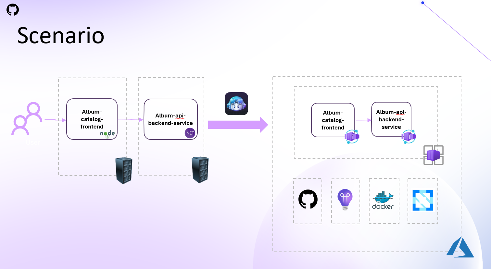

# Modernize a Legacy Application with GitHub Copilot

This is a legacy application that is being migrated to the cloud. 


## Prerequisites

- [.NET](https://dotnet.microsoft.com/en-us/download)
- [Node.js](https://nodejs.org/en/)
- [Docker](https://www.docker.com/)
- [Azure CLI](https://docs.microsoft.com/en-us/cli/azure/install-azure-cli)
- [GitHub Copilot Extension](https://copilot.github.com/)
- [Visual Studio Code](https://code.visualstudio.com/)
- [Azure Subscription](https://azure.microsoft.com/en-us/free/)

## Challenge

For running this challenge, please checkout the [demo branch](https://github.com/RenatoSGR/legacyapp/tree/demo) and do the next steps and GitHub Copilot prompts under that branch, since this main branch already has all the code and actions needed to deploy the application to Azure Container Apps, with the full solution already implemented. 

### The Application
The application is a simple album catalog that consists of two parts:

- Album API: A .NET Core Web API that provides CRUD operations for albums.
- Album UI: A React application that consumes the Album API.

The Album API is a legacy application that is running on a Windows Server 2016 VM. The Album UI is a legacy application that is running on a Windows Server 2016 VM.

The goal is to modernize and migrate the Album API and Album UI to the cloud.

### Architecture and Scenario



After a successful containerization of the Album API and Album UI, the next step is to push the container images to a container registry and deploy the containers to an Azure Service that can host the Album API and Album UI as containers.

For this challenge, we will use Azure Container Apps to host the Album API and Album UI.

Find more information about **Azure Container Apps** [here](https://docs.microsoft.com/en-us/azure/container-apps/).

## Running locally the application

### Album API
To run the albumapi:

```shell
cd containerapps-albumapi-csharp/src
dotnet run
```

### Album UI

Install cross-env:
```shell
npm install --global cross-env
```
Install npm dependencies:

```shell
cd containerapps-albumui/src
npm install
```
Run album ui:
```shell
npm run start
```

**Note** to connect the Album UI to the Album API, you need to update the `process.env.API_BASE_URL` in the `.env` file iorder to point to the Album API URL.

## Using GitHub Copilot to modernize the application

GitHub Copilot is an AI pair programmer that helps you write code faster and with less effort. It draws context from the code you’re working on and suggests whole lines or entire functions. You can try GitHub Copilot in Visual Studio Code by installing the GitHub Copilot extension.

### Success criteria

🎯 Show the Album Application containerized and running in Azure (eg: in a AKS, ACA, App Services)

### Instructions

### 1. Setup your environment

Make sure the following extensions are installed in your Visual Studio Code:

- GitHub Copilot
- GitHub Copilot Chat

### 2. Clone the repository

aka.ms/gh-legacyapp

### 3. Modernize the Album Application

#### 3.1 Let's start interact with GitHub Copilot to modernize the application.

<details>
<summary>💡 GitHub Copilot tip - Chat View

</summary>

> Did you know that GitHub Copilot can provide information about your current workspace on VScode?


> 
> `@workspace can you explain what projects are in this workspace?`
</details>
<br/>  

#### 3.2 Now let's modernize the Album Application.

<details>
<summary>💡 GitHub Copilot tip - Chat View

</summary>


> 

> `@workspace I want to modernize my two projects, and with that, I want a Dockerfile for each one. For the containerapps-albumapi-csharp project, use the sdk 6 version and expose the api on port 8080. For the containerapps-albumui app expose the ui under port 3000`
</details>
<br/>  

#### 3.3 let's ask GitHub Copilot to help us explaining the Dockerfiles.

<details>
<summary>💡 GitHub Copilot tip - Interaction Mode View

</summary>

> Did you know that you can open and interactive window on GitHub Copilot pressing crtl+I on your file?

> 

> `Hit ctrl+I inside the Dockerfile previously created and after select all code hit /explain to see the explanation of the code.`
</details>
<br/>  


#### 3.4 Now let's build the Docker images for the Album API and Album UI.

<details>

<summary>💡 GitHub Copilot tip - Chat View

</summary>

> 

> `How to build and run my container into my local machine`
</details>
<br/>  

#### 3.5 Let's ask Copilot if can provide me some principles of Infrastructure as Code.


<details>
<summary>💡 GitHub Copilot tip - Chat View

</summary>

> Did you know that Copilot can provide you Infrastructure as Code files to deploy your workload and resources to a cloud provider?

> 

> `If I want to use the principles of Infrastructure as a code and use terraform, can you provide me with all the resources needed to run my applications on azure container apps, using the azure provider?`
</details>
<br/>  


#### 3.6 Now let's deploy the Album API and Album UI to Azure Container Apps, using GitHub actions workflows.

<details>

<summary>💡 GitHub Copilot tip - Chat View

</summary>


> 

> `@workspace now if I want to deploy my two applications into azure under azure container apps, can you provide me the github actions workflow to do that?`
</details>
<br/>  

#### 3.7 Let's ask Copilot to explain the GitHub Actions workflow.

<details>
<summary>💡 GitHub Copilot tip - Interaction Mode View

</summary>

> Did you know that you can open and interactive window on GitHub Copilot pressing crtl+I on your file?

> 

> `ctrl+I on the gh action file and hit /explain `
</details>
<br/>  

### 4. Deploy the Album Application to Azure

#### 4.1 Push the changes to your GitHub repository.

```shell
git add .
git commit -m "Modernize the Album Application"
git push
```

#### 4.2 Create the secrets and variables that are needed for the GitHub Actions workflow.

- AZURE_CREDENTIALS: The Azure service principal credentials.
- CONTAINE_REGISTRY_NAME: The name of the Azure Container Registry.
- CONTAINER_REGISTRY_USERNAME: The username of the Azure Container Registry.
- CONTAINER_REGISTRY_PASSWORD: The password of the Azure Container Registry.

#### 4.3 Run the GitHub Actions workflow to deploy the Album Application to Azure Container Apps.

Under the Actions tab in your GitHub repository, you will see the GitHub Actions workflow that was created. Click on the workflow and then click on the Run workflow button to start the deployment process.

#### 4.4 Access the Album Application running in Azure.

After the deployment process is completed, you can access the Album Application running in Azure by navigating to the URL provided by Azure Container Apps.

### 5. Enhance your solution

#### 5.1 Add telemetry to the Album API and Album UI.

<details>
<summary>💡 GitHub Copilot tip - Chat View

</summary>

> 

> `If I want to integrate my backend app with azure application insights sdk for c# can you give me the code for that?`
</details>
<br/>  

#### 5.2 Can I use OpenTelemetry sdk?

<details>
<summary>💡 GitHub Copilot tip - Chat View

</summary>

> 

> `Can you provide me as well the code for opentelemetry sdk?`
</details>
 

### 6. Adding cloud-native principles and best practices

#### 6.1 Ask Copilot to provide you with some best practices for cloud-native applications.


<details>
<summary>💡 GitHub Copilot tip - Chat View

</summary>

> 

> `@workspace I want that my app could follow the cloud native principles, like high availability, resiliency, scalability and so on, can you provide me some insights and tools to help me achieve that, like for instance using keda, prometheus, istio, etc?`
</details>
<br/>  


#### 6.2 Ask Copilot to provide some pillars of Application Modernization.

<details>
<summary>💡 GitHub Copilot tip - Chat View

</summary>

> 

> `what do you think should be the five pillars for application modernization?`
</details>
<br/>  

## Conclusion

### ✨ Let's review GitHub Copilot

- Was it able to give you suggestions about application modernization?  
- Was generated all the steps to deploy and modernize your legacy application?  
- Provide you the automation to deploy the application in Azure?
- How else did it help you?

### 🗑️ Clean up Azure resources

If you deployed this application to Azure, remember to delete any resources you created to avoid incurring costs.

#### 📈 You had any problems with this challenge, an idea how to improve it or an idea for a new challenge? We are looking forward for your feedback as an issue or pull request. ✨